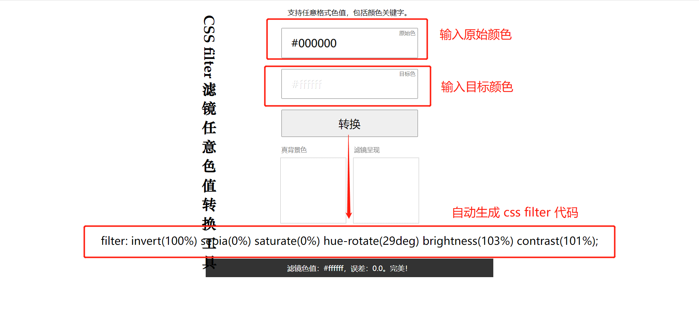
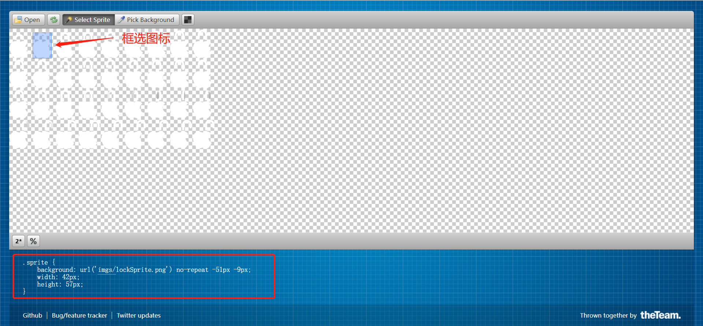

# 前端常见效果实现

## less 遍历颜色

### 代码

```vue
<template>
  <div>
    <div class="colorBtn" v-for="(item, index) in 5" :key="item"></div>
  </div>
</template>

<script>
export default {};
</script>

<style lang="less" scoped>
@colorArr: #576856, #f1f2ed, #fae7cf, #54524f, #a7c1d9;
@len: length(@colorArr);

.Loop(@index) when(@index<@len+1) {
  // 执行内容
  // 类名参数要加大括号@{index}
  // 根据index获取对应的某个值 extract(数组名, 对应的序号)
  .colorBtn:nth-child(@{index}) {
    background-color: extract(@colorArr, @index);
  }
  //递归调用 达到循环目的
  .Loop(@index+1);
}
.Loop(1);

.colorBtn {
  display: inline-block;
  width: 30px;
  height: 30px;
  border-radius: 50%;
  margin-right: 20px;
}
</style>
```

### 效果

<changeColor/>

更多 less 用法：[less 官方文档](https://less.bootcss.com/)

## css filter

### css filter 常用属性

- **模糊:** filter: blur(5px);
- **亮度:** filter: brightness(300%);
- **对比度:** filter: contrast(200%);
- **阴影:** filter: drop-shadow(10px 5px 5px #666);
- **灰度:** filter: grayscale(100%);
- **色相旋转:** filter: hue-rotate(90deg);
- **反色:** filter: invert(100%);
- **透明度:** filter: opacity(50%);
- **饱和度:** filter: saturate(200%);
- **褐色程度:** filter: sepia(60%);

### css filter 自动生成

css filter 自动生成：[css filter 自动生成戳这里](https://www.zhangxinxu.com/sp/filter.html)



### 代码

```vue
<template>
  <div class="bgc">
    <button @click="addFilter">添加滤镜</button>
    <button @click="removeFilter">清除滤镜</button>
    <div :class="{ filter: isFilter }"></div>
  </div>
</template>

<script>
export default {
  data() {
    return {
      isFilter: false,
    };
  },
  methods: {
    addFilter() {
      this.isFilter = true;
    },
    removeFilter() {
      this.isFilter = false;
    },
  },
};
</script>

<style lang="less" scoped>
.bgc {
  background-color: aquamarine;
  height: 200px;
  text-align: center;
  div {
    width: 100px;
    height: 100px;
    background-color: #000;
    margin: 30px auto;
  }
  .filter {
    filter: invert(100%) sepia(0%) saturate(0%) hue-rotate(29deg) brightness(
        103%
      ) contrast(101%);
  }
}
</style>
```

### 效果

<css-filter/>

## 文字逐渐显示效果

根据 background-clip 特性实现 [background-clip](https://developer.mozilla.org/zh-CN/docs/Web/CSS/background-clip)

### 代码

```vue
<template>
  <div class="cametaPatameters">
    <div class="line">我是一段会逐渐显示的文字~~~~~~~~</div>
  </div>
</template>

<script>
export default {};
</script>

<style lang="less" scoped>
.cametaPatameters {
  background: #000;
  height: 50px;
  padding: 10px;
  .line {
    font-family: "Times New Roman", Times, serif;
    font-size: 30px;
    color: #fff;
    background-image: linear-gradient(
      to right,
      rgba(255, 255, 255, 1) 0%,
      rgba(255, 255, 255, 1) 33.33%,
      rgba(255, 255, 255, 0) 66.67%,
      rgba(255, 255, 255, 0) 100%
    );
    background-size: 300% 100%;
    background-position-x: 100%;

    background-clip: text;
    -webkit-background-clip: text;
    color: transparent;

    transition: 2s all ease-in-out;
  }
  .line:hover {
    background-position-x: 0%;
  }
}
</style>
```

### 效果

将鼠标移入黑色区域
<wordShow/>

## 动态精灵图

首先推荐一个自动生成某个图标在精灵图位置代码的网站：[精灵图代码生成](http://www.spritecow.com/)  
导入图片，点击要获取位置代码的图标，即可自动生成代码。


## css 动画属性

- animation-name: 2s;  
  设置所需动画名称
- animation-delay: 2s;  
  设置延时，即从元素加载完成之后到动画序列开始执行的这段时间。
- animation-iteration-count: infinite;  
  设置动画重复次数， 可以指定 infinite 无限次重复动画
- animation-direction: alternate-reverse;  
  设置动画在每次运行完后是反向运行还是重新回到开始位置重复运行。
- animation-duration: 1s;  
  指定一个动画周期的时长。
- animation-play-state: running;  
  定义一个动画是否运行或者暂停。
- animation-timing-function: ease;  
  设置动画速度， 即通过建立加速度曲线，设置动画在关键帧之间是如何变化。
- animation-fill-mode: none;  
  指定动画执行前后如何为目标元素应用样式。

  **此外，想要完成动态精灵图的效果，我们还需要学会 css animation 中 steps 的使用:**
  [steps 属性](https://www.cnblogs.com/yangpeixian/p/11227683.html)

## 代码

```vue
<template>
  <div class="sprite">
    <div class="lock" ref="ani"></div>
    <button @click="operateAni">暂停/开始</button>
  </div>
</template>

<script>
export default {
  data() {
    return {
      opAni: true,
    };
  },
  methods: {
    operateAni() {
      this.opAni = !this.opAni;
      this.$refs.ani.style.animationPlayState = !this.opAni
        ? "paused"
        : "running";
    },
  },
};
</script>

<style lang="less" scoped>
.sprite {
  background: #000;
  height: 100px;
  padding: 50px;
  .lock {
    margin: 20px 100px 0 0;
    width: 48px;
    height: 64px;
    display: inline-block;

    background: url("../public/img/animationEffect/lockSprite.png") no-repeat;
    background-position: -1px -1px;
    animation: lock 1s steps(1);
    animation-iteration-count: infinite;
  }
  @keyframes lock {
    0% {
      background-position: -1px -1px;
    }
    2.77778% {
      background-position: -51px -1px;
    }
    5.55556% {
      background-position: -101px -1px;
    }
    8.33333% {
      background-position: -151px -1px;
    }
    11.1111% {
      background-position: -201px -1px;
    }
    13.8889% {
      background-position: -251px -1px;
    }
    16.6667% {
      background-position: -301px -1px;
    }
    19.4444% {
      background-position: -351px -1px;
    }
    22.2222% {
      background-position: -401px -1px;
    }
    25% {
      background-position: -1px -67px;
    }
    27.7778% {
      background-position: -51px -67px;
    }
    30.5556% {
      background-position: -101px -67px;
    }
    33.3333% {
      background-position: -151px -67px;
    }
    36.1111% {
      background-position: -201px -67px;
    }
    38.8889% {
      background-position: -251px -67px;
    }
    41.6667% {
      background-position: -301px -67px;
    }
    44.4444% {
      background-position: -351px -67px;
    }
    47.2222% {
      background-position: -401px -67px;
    }
    50% {
      background-position: -1px -133px;
    }
    52.7778% {
      background-position: -51px -133px;
    }
    55.5556% {
      background-position: -101px -133px;
    }
    58.3333% {
      background-position: -151px -133px;
    }
    61.1111% {
      background-position: -201px -133px;
    }
    63.8889% {
      background-position: -251px -133px;
    }
    66.6667% {
      background-position: -301px -133px;
    }
    69.4444% {
      background-position: -351px -133px;
    }
    72.2222% {
      background-position: -401px -133px;
    }
    75% {
      background-position: -1px -199px;
    }
    77.7778% {
      background-position: -51px -199px;
    }
    80.5556% {
      background-position: -101px -199px;
    }
    83.3333% {
      background-position: -151px -199px;
    }
    86.1111% {
      background-position: -201px -199px;
    }
    88.8889% {
      background-position: -251px -199px;
    }
    91.6667% {
      background-position: -301px -199px;
    }
    94.4444% {
      background-position: -351px -199px;
    }
    97.2222% {
      background-position: -401px -199px;
    }
    100% {
      background-position: -401px -199px;
    }
  }
}
</style>
```

## 效果

原精灵图效果
<showSprite/>

动态精灵图效果
<sprite/>
