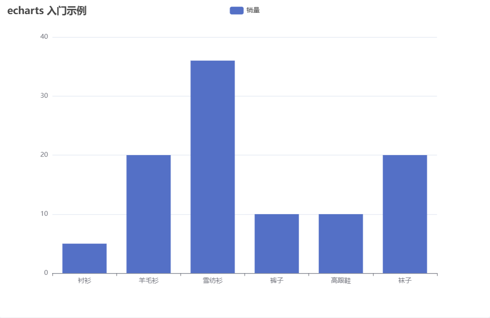
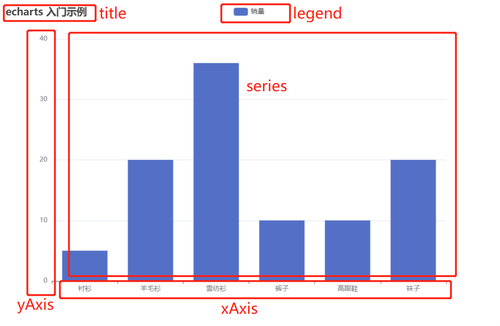
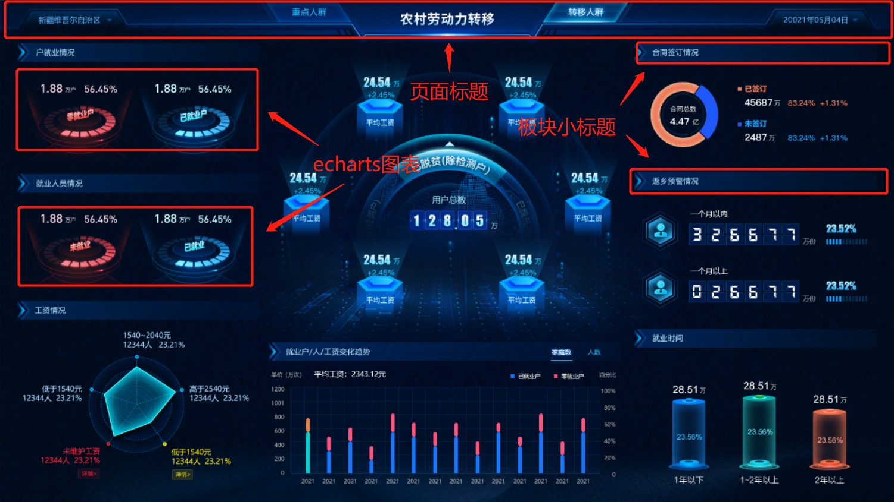
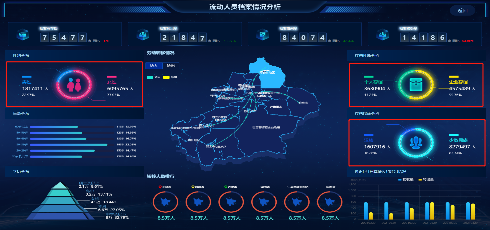
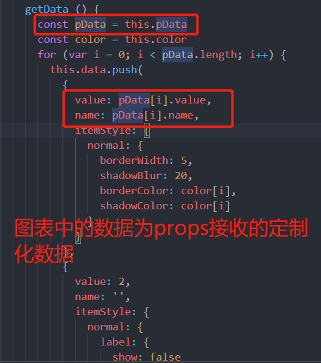
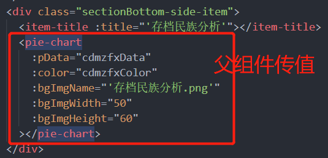

# 怎样开发一个大屏

## 开发前的准备工作

### 确定大屏需适配的分辨率

不同的大屏项目有不同的分辨率要求，我们需要根据项目经理制定的项目具体要求去适配所需的分辨率。此外，一些项目只要求适配一种分辨率即可，那我们可以将页面大小固定之后开发。如果要求能适配多种分辨率，我们就需要制定大屏适配方案去达成这一目的（详细请看<a href="#adapter">大屏适配</a>板块）。

### 确定原型中页面元素的展示、交互效果

一个项目产品最能给予用户反馈的首先就是页面的展示效果，这一点在数据可视化大屏的开发中更为凸显。原型图主要用于和领导或目标客户确认软件的最终呈现效果。原型图可以生动的展示最终效果并支持初步的模拟操作和测试，因此可以用于验证软件设计理念，以及接收修改意见和设计缺陷反馈。开发人员根据原型图可以直观的看到客户想要怎样的页面元素效果、交互效果，根据原型图进行页面开发能更趋近于用户的要求，达到用户的理想效果。

### 确定数据与可视化元素之间的关系

通过大屏展示的数据都是后端人员传给我们的真实存在的数据，每个数据都有其意义，我们需要弄清数据和可视化元素之间的关系，有助于组件的封装。有时候给到我们的数据不一定是我们想要的数据格式，这时候我们需要先和后端人员沟通，确定传给我们的数据是怎样的，再将数据处理为我们想要的数据通过可视化元素展现到页面上。这一步可以防止因为数据格式不统一造成的开发效率降低。

### 确定多页面之间的交互

许多大屏项目中包含多个页面，这些页面之间可能存在交互，可能有共有数据，可能有参数传递，可能有路由跳转，我们需要清楚多页面间的交互逻辑是怎样的，这一步不仅有利于我们对于组件的封装，同样有利于我们划分项目结构。

### 了解项目目录结构

不同的项目有不同的项目目录结构，将各类文件存放在正确的文件目录中，不仅有利于我们的开发，更有利于项目的后续维护。一个项目开发者众多，大家都有各自的习惯，那我们怎样让大家达成一个共识呢？这时候就需要制定一个共同的约束去规范项目结构，需要每一个项目开发者去遵守，来保证目录结构的统一化、可读性、分模块、组件构建，禁止构建杂乱无章、毫无可读性而言的项目目录。

## 大屏开发常用技术<font id="adapter"></font>

### 大屏适配

#### 利用 css 的 transform 属性以及设计百分比以及 scal（）方法

创建一个 ScreenAdapter.vue 文件，将下面代码复制到 ScreenAdapter.vue 文件中

```
<template>
  <div class="screen-adapter">
    <div class="content-wrap" :style="style">
      <slot />
    </div>
  </div>
</template>

<script>
export default {
  name: 'ScreenAdapter',
  data() {
    return {
      style: {
        width: `${this.w}px`,
        height: `${this.h}px`,
        transform: 'scale(1) translate(-50%, -50%)', // 默认不缩放，垂直水平居中
      },
    };
  },
  props: {
    w: { // 设计图尺寸宽
      type: Number,
      default: 1920,
    },
    h: { // 设计图尺寸高
      type: Number,
      default: 1080,
    },
  },
  mounted() {
    this.setScale();
    this.onresize = this.debounce(() => this.setScale(), 100);
    window.addEventListener('resize', this.onresize);
  },
  methods: {
    // 防抖
    debounce(fn, t) {
      const delay = t || 500;
      let timer;
      // eslint-disable-next-line func-names
      return function () {
        // eslint-disable-next-line prefer-rest-params
        const args = arguments;
        if (timer) {
          clearTimeout(timer);
        }
        const context = this;
        timer = setTimeout(() => {
          timer = null;
          fn.apply(context, args);
        }, delay);
      };
    },
    // 获取缩放比例
    getScale() {
      console.log(window.innerHeight, window.innerWidth);
      const w = window.innerWidth / this.w;
      const h = window.innerHeight / this.h;
      return w < h ? w : h;
    },
    // 设置缩放比例
    setScale() {
      this.style.transform = `scale(${this.getScale()}) translate(-50%, -50%)`;
    },
  },
  beforeDestroy() {
    window.removeEventListener('resize', this.onresize);
  },
};
</script>

<style lang="less">
.screen-adapter {
  width: 100vw;
  min-height: 100%;
  max-height: 100vh;
  overflow: hidden;
  background: url("../../assets/charts/icon-bg.png") no-repeat;
  background-size: 100% 100%;

  .content-wrap {
    transform-origin: 0 0;
    position: absolute;
    top: 50%;
    left: 50%;
    padding: 18px 64px;
  }
}
</style>
```

在想要适配分辨率的页面中引入该 ScreenAdapter.vue 组件,将页面元素放入 ScreenAdapter 组件即可。此时无论我们怎样缩放页面，页面元素都会自适应页面大小。

### 图表使用

#### 安装

```
npm install echarts --save
```

#### 引入

引入方法一： 全局引入

main.js 页面

```
import echarts from 'echarts'
Vue.prototype.$echarts = echarts
```

引入方法二： 按需引入

需要用到 echarts 的图表页面

```
import echarts from 'echarts'
```

#### 初始化图表实例

1. 在绘图前需要为 echarts 准备一个定义了宽高的 DOM 容器

```html
<div ref="pie" style="width: 600px; height:400px"></div>
```

2. 通过 echarts.init 方法初始化一个 echarts 实例

```js
// 全局引入初始化实例方式
const myChart = this.$echarts.init(this.$refs.pie);
// 按需引入初始化实例方式
const myChart = echarts.init(this.$refs.pie);
```

3. 指定配置项和数据（option）

```js
let option = {
  title: {
    text: "echarts 入门示例",
  },
  legend: {
    data: ["销量"],
  },
  xAxis: {
    data: ["衬衫", "羊毛衫", "雪纺衫", "裤子", "高跟鞋", "袜子"],
  },
  yAxis: {
    type: "value",
  },
  series: [
    {
      name: "销量",
      type: "bar",
      data: [5, 20, 36, 10, 10, 20],
    },
  ],
};
```

4. 将配置项设置给 echarts 实例对象

```js
myChart.setOption(option);
```

**效果图**如下：



那么上面 option 配置项里各自配置的是哪个板块呢？

`title`：标题组件，包含主标题和副标题  
`legend`：图例组件  
`xAxis`：直角坐标系 grid 中的 x 轴  
`yAxis`：直角坐标系 grid 中的 y 轴  
`series`：图表数据



echarts 的配置项还远远不止这些，想要通过 echarts 绘制出不同样式的图表，需要在练习过程中不断熟悉这些配置项。下面给出 echarts 官方文档，可查询 echarts 配置项和 API，供大家查阅学习。

**echarts 配置项文档：**  
<https://echarts.apache.org/zh/option.html#title>  
**echarts API 文档：**  
<https://echarts.apache.org/zh/api.html#echarts>

### 组件封装

大屏项目中页面风格趋于一致，所以许多页面元素可以重复利用，只需要更换其内部数据即可。为了提高页面开发效率，我们通常会将这些可重复使用的页面元素封装成组件。需要将哪些页面元素封装成组件，则需根据具体页面情况而定。

如大屏适配中的 **ScreenAdapter.vue**，本质就是一个**公用组件**。项目中的页面一般来说都需要进行统一适配，所以在我们的每个页面中都需要引入 **ScreenAdapter.vue 组件**。

此外，如页面标题、板块小标题、echarts 图表等板块，都可根据项目实际情况进行组件封装。



但各板块肯定不会完全相同，可能存在文本、颜色、图片等元素的差异，这时候我们就需要将这些特殊的数据提取出来，让组件调用者自行定制其中的内容。例如下面的 echarts 饼图组件的封装：



下面是 echarts 饼图组件中提取出的可定制化元素，通过 **props 接收父组件传递给该子组件的定制化数据**并通过图表展示

```
props: {
    pData: {
      type: Array,
      default: () => [
        {
          name: '男性',
          value: 2456578
        },
        {
          name: '女性',
          value: 2456578
        }
      ]
    },
    color: {
      type: Array,
      default: () => ['#0590fc', '#ff2b85']
    },
    bgImgName: {
      type: String,
      default: '性别.png'
    },
    bgImgWidth: {
      type: Number,
      default: 65
    },
    bgImgHeight: {
      type: Number,
      default: 80
    },
    unit: {
      type: String,
      default: '人'
    }
  }
```





这样，我们就可以在组件中定制想要的元素内容了

### 数据模拟

在大屏开发过程中，难免会遇到我们的前端页面已经写好，但是后端接口还没有的情况，但我们又需要数据去测试、展示页面元素，这时候我们就需要去模拟数据。这里推荐使用 **Mock.js 模拟数据生成器**。

Mock.js 基础使用：<https://www.cnblogs.com/laine001/p/9779288.html>

Mock.js 官网：<http://mockjs.com/>

Mock.js 文档：<http://mockjs.com/0.1/>

## 常见效果与实现

**echarts 常见效果示例：**  
<https://echarts.apache.org/examples/zh/index.html>  
<https://www.isqqw.com/#/homepage>  
<http://ppchart.com/#/>  
<http://analysis.datains.cn/finance-admin/#/chartLib/all>

## 开发注意事项

### 内存溢出问题

一些大屏项目页面众多，每点击一个页面都会创建数个 echarts 图表实例，点击页面过多时，可能会造成内存溢出问题，所以在离开页面之前，最好对已创建的 echarts 图表实例进行销毁。

```js
//销毁图表实例，防止内存溢出
beforeDestroy () {
  const myCharts = echarts.getInstanceByDom(this.$refs.pie)
  if(myChart !== null){
    myCharts.dispose()
  }
},
```

### echarts 中出现 tooltip 时页面相对定位布局出现抖动

**原因：**
在 echarts 图表中出现 tooltip 时，画布的父标签（即：echarts.init()的标签）的有时宽高都会发生变化，导致相对布局的 div 可能大小发生变化（画布大小却不变），导致页面闪动。

**解决：**
在该画布的父标签（即：echarts.init()的标签）外层套一个 div，设置 overflow:hidden；然后，设置 tooltip 的 confine：true;(设置 tooltip 不超出图表)。

### 异步请求数据传入组件时 echarts 图表不显示(不停接收传入的数据并实时更新图表)

**原因：**
在异步请求的数据传入组件之前，echarts 图表实例已经创建

**解决：**
在 watch 中监听传入的数据，在数据变化后再初始化 echarts 实例

```js
watch: {
    // 判断数据变化，实时更新图表(pieData为传入数据)
    pieData (newValue, oldValue) {
      // 获取已有echarts实例的DOM节点
      let myChart = echarts.getInstanceByDom(this.$refs.pie)
      // 判断是否创建实例
      if (myChart == null) {
        myChart = echarts.init(this.$refs.pie)
      }
      let options = this.initOptions()
      myChart.setOption(options)
    }
  },
```

### 更多问题

更多常见问题：<https://echarts.apache.org/zh/faq.html>
