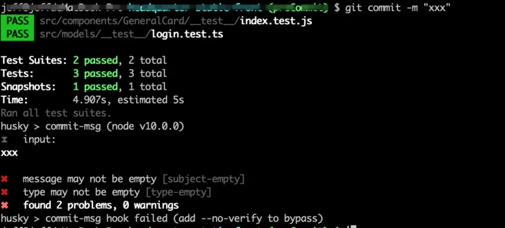
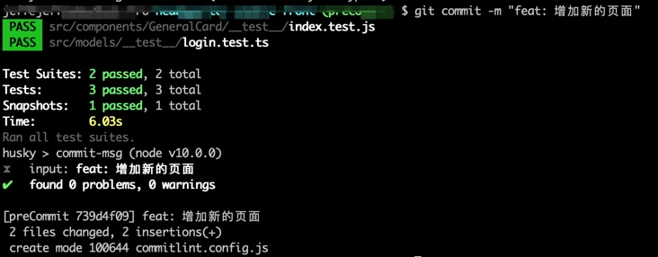
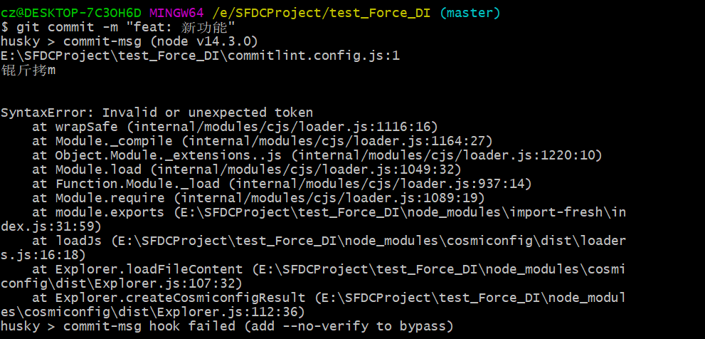
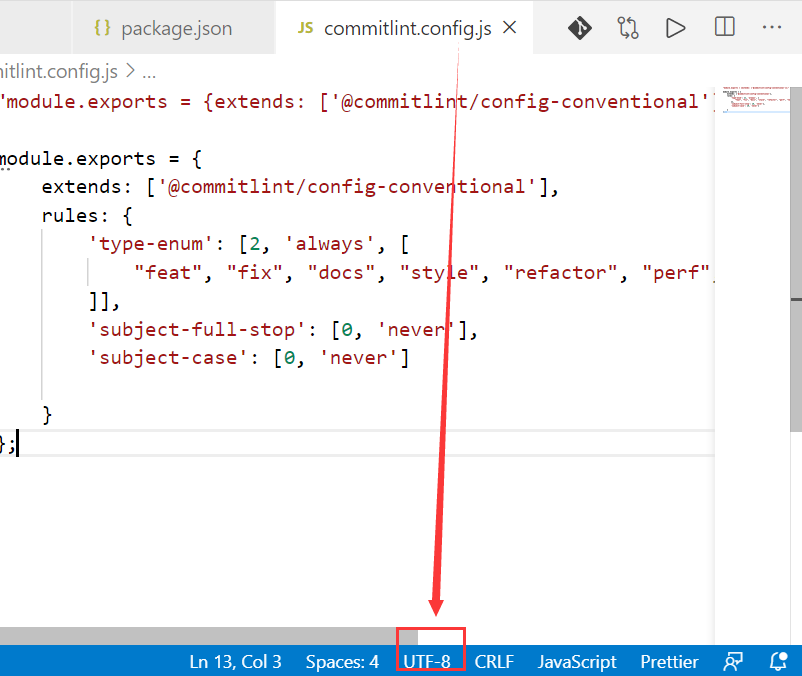

# commitlint

## 安装

### 1.安装 Husky

husky 是一个 git hook 的管理工具，实现了大部分的 git hook，一般情况下，commitlint 会用在 git 的 hook 回调中，如果不想自己写 githooks，那么最简单的就是和 husky 一起使用。

```
npm install husky@4.3.8 -D
或者
yarn add husky@4.3.8 -D
```

### 2.安装 commitlint

```
npm install --save-dev @commitlint/config-conventional @commitlint/cli
或者
yarn add  @commitlint/config-conventional @commitlint/cli -D
```

## 配置

### 1.package.json 中配置 husky.hooks

在 husky 的配置加入 CommitlIint 配置，v1.0.1 版本以后为 HUSKY_GIT_PARAMS，v0.14.3 为 GIT_PARAMS

```
"husky": {
  "hooks": {
    "commit-msg": "commitlint -e $HUSKY_GIT_PARAMS"
  }
},
```

### 2.生成 commitlint 配置文件

生成配置文件 commitlint.config.js

```
echo "module.exports = {extends: ['@commitlint/config-conventional']};" > commitlint.config.js
```

### 3.commitlint.config.js 文件配置

rule 由 name 和配置数组组成，如：'name:[0, 'always', 72]'，数组中第一位为 level，可选 0,1,2，0 为 disable，1 为 warning，2 为 error，第二位为应用与否，可选 always|never，第三位该 rule 的值。具体配置例子如下：

```
module.exports = {
  extends: [
    "@commitlint/config-conventional"
  ],
  rules: {
    'type-enum': [2, 'always', [
      'feat', 'fix', 'improvement', 'docs', 'style', 'refactor', 'pref', 'build', 'chore', 'revert'
     ]],
    'type-case': [0],
    'type-empty': [0],
    'scope-empty': [0],
    'scope-case': [0],
    'subject-full-stop': [0, 'never'],
    'subject-case': [0, 'never'],
    'header-max-length': [0, 'always', 72]
  }
};
```

这里列出了大部分常用的配置，其它的可以参考 Commitlint 网站

## 使用

配置完成之后，我们可以试着修改项目文件，然后进行`git commmit -m "xxx"`操作。

这里我们使用错误的提交方式，最上面的是自动测试的脚本，大家可以忽略，husky 给出了 commit-msg 的 input 为 xxx，触发了 subject-empty，type-empty 两个规则，提交不符合规范，被拦了下来。如果是正确的提交，例子如下：

::: warning 注意
feat:后需有空格
:::

#### feat 到底是什么意思呢？下面列出 commitlint 常用提交规范 type 类别(项目中 <u>强制要求</u> 使用该规范)：

- feat: 新功能
- fix: 修复 BUG
- improvement: 对当前功能的改进
- docs: 仅仅文档修改
- style: 不影响代码的改变，例如：空格、格式
- refactor: 重构，既不修复错误也不添加功能的代码更改
- pref: 提高性能的代码更改
- build: 影响生成系统或外部依赖项的更改（示例范围：gulp、broccoli、npm）
- chore: 不修改 src 或测试文件的其他更改
- revert: 还原以前的提交

例子：

```
git commit -m 'feat: 添加xxx管理模块'
git commit -m 'fix: 修复xxxxBUG，fixed #xxxxxxx'
git commit -m 'docs: 修改/添加xxxx文档'
```

::: warning 注意
提交时类别后面 : 后都需有空格
:::

## 注意事项

### Commit husky 报错

husky > commit-msg hook failed (add --no-verify to bypass)


#### 解决方法

commitlint.config.js 的编码修改为 UTF-8

