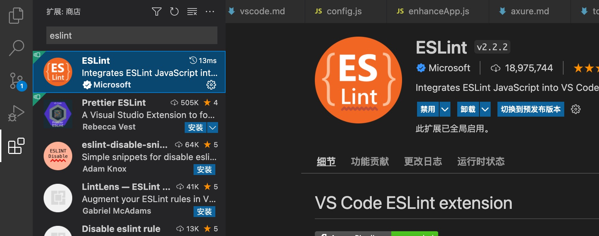
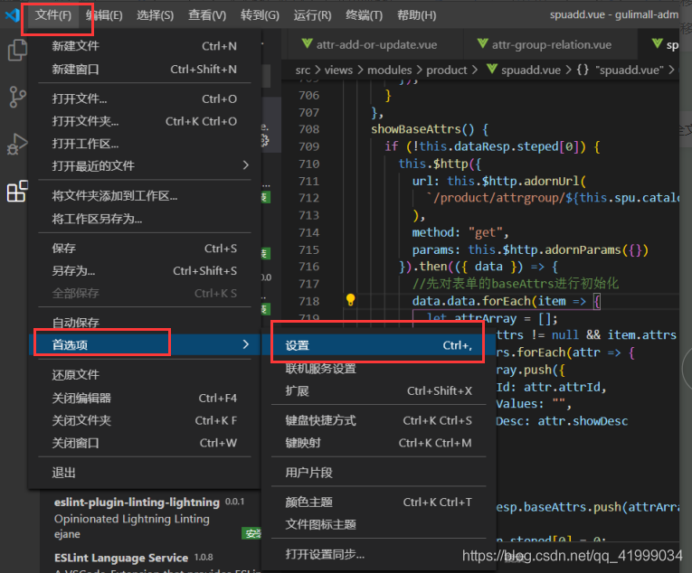
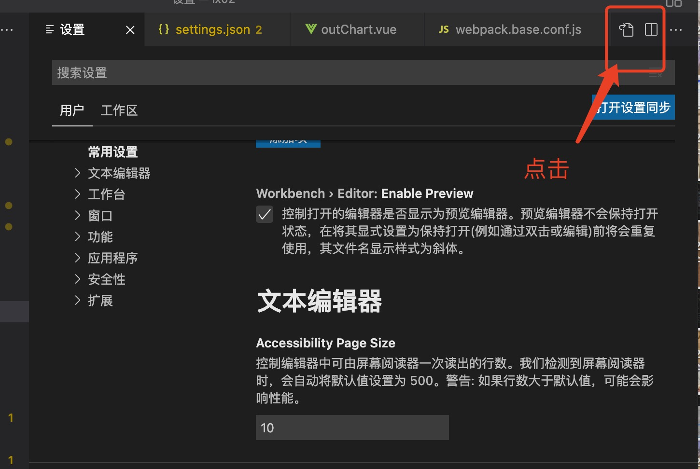
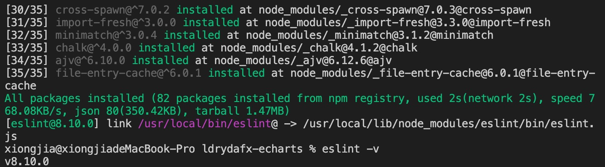
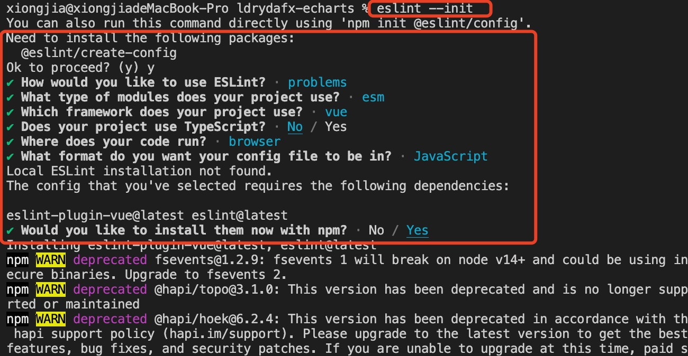
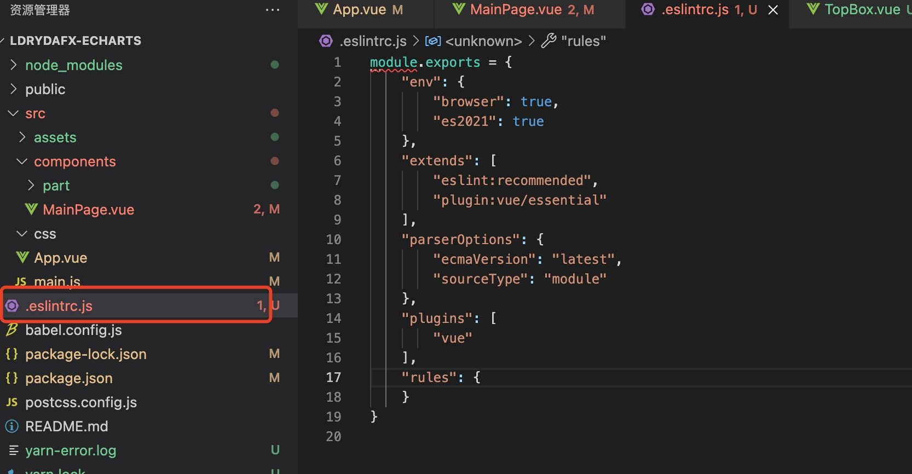
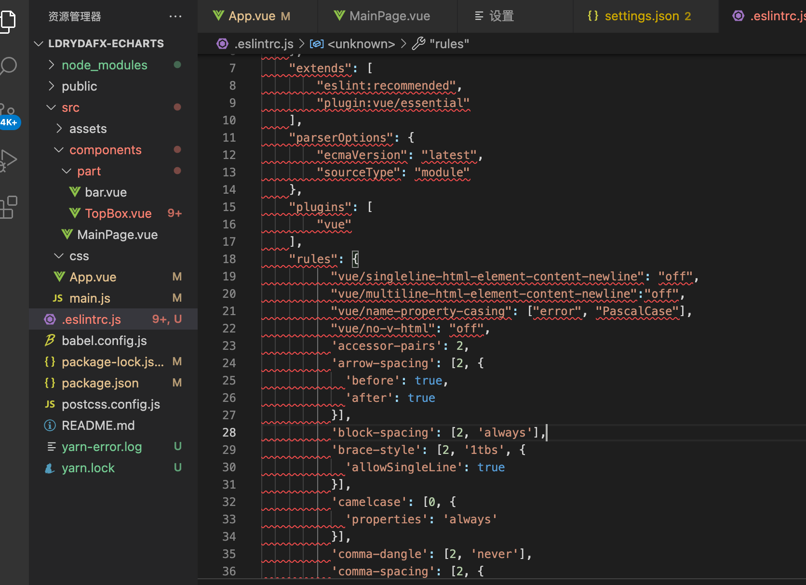

# eslint

## 在 vscode 安装 eslint 插件

- 在插件市场搜索 eslint，找到下插件，点击安装
  
- 配置 settings.json，设置启用 eslint 自动格式化

  - 步骤 1: 在 vscode 菜单栏中选择文件--首选项--设置（macOS 系统直接使用快捷键: command+,）
    
  - 步骤 2: 点击右上角，打开 settings.json 文件
    
  - 步骤 3: 将下面代码复制到 settings.json 文件中并保存退出

    ```
    {
    "editor.formatOnSave": false,
    // 自动修复
    "editor.codeActionsOnSave": {
    "source.fixAll.eslint": true,
    },
    // 配置 ESLint 检查的文件类型
    "eslint.validate": ["javascript","vue","html"]
    }
    ```

- 退出后，在 vscode 中编译代码如果出现格式错误问题，使用 ctrl+s（macOS 使用 command+s）后代码会自动纠正格式。

## npm 安装 ESlint

先决条件：安装了 Node.js,，并且 Node.js 版本>=6.14, npm 版本 3+。

### 1. 安装

- 执行下列命令全局安装或本地安装 ESlint(windows 系统和 macOS 系统操作相同)

```
npm install -g eslint     // 全局安装
npm install eslint --save-dev     // 本地安装
```

安装完成后可通过如下命令查看 eslint 的版本：

```
eslint -v
```



- 生成配置文件
  执行下列命令，并且在一步步初始化之后，会在用户目录中生成一个名为.eslintrc.js 配置文件

```
eslint --init
```

初始化过程如下图：  

初始化的步骤和说明可参考: <https://www.jianshu.com/p/48a7a6e766c4>

- .eslintrc.js 配置文件
  生成的配置文件如下：  
  
  配置文件的具体解释说明可以参考: <https://blog.csdn.net/weixin_43893844/article/details/118531930>

### 2. 配置 ESlint

- 生成配置文件后可以根据用户需要自行扩展规则，可参考:  
  <https://blog.csdn.net/weixin_43893844/article/details/118531930>  
  <https://segmentfault.com/a/1190000009077086>
- ESlint 的规则有三个级别
  - "off"或者 0: 不启用这个规则
  - "warn"或者 1: 出现问题会有警告
  - "error"或者 2: 出现问题会报错
- 添加了规则后如下：  
  
- 在 vscode 菜单栏中选择文件--首选项--设置（macOS 系统直接使用快捷键: command+,），点击右上角图标打开 settings.json 文件，粘贴如下代码：

```
 "eslint.options": {
   // 低版本使用的可能是configFile，但该使用版本8.10.0已经更改为overrideConfigFile
      "overrideConfigFile": "/Users/xiongjia/Documents/HBuilderProjects/ldrydafx-echarts/.eslintrc.js"
  },
```

至此为止，我们已经可以使用 ESlint 来检测 js 代码规范了。  
::: tip 提示

1. npm 安装的 eslint 也可以实现在保存时就纠正代码格式，可以在 settings.json 中使用上方 1.在 vscode 安装 eslint 插件的步骤 3 中的代码。
2. 如果我们需要支持类 html 文件（如 vue）的内联脚本检测，还需要安装 eslint-plugin-html 插件。安装完成后还需要在 settings.json 文件中插入如下代码：

```
"eslint.options": {
    "overrideConfigFile": "/Users/xiongjia/Documents/HBuilderProjects/ldrydafx-echarts/.eslintrc.js",
    "plugins": ["html"]
},
"eslint.validate": [
    "javascript",
    "javascriptreact",
    "html",
    "vue"
]
```

:::

## ESlint 规则

可前往 ESlint 官网了解规则: <http://eslint.cn/docs/rules/>
::: tip 提示
如果我们在 vue 的项目开发中，出现了一些 ESlint 的错误，影响不大的错误想要忽视掉，可以使用 eslint-disable，后面加上规则名称就可以了，如下面所示:

```
/* eslint-disable no-new */
```

:::
