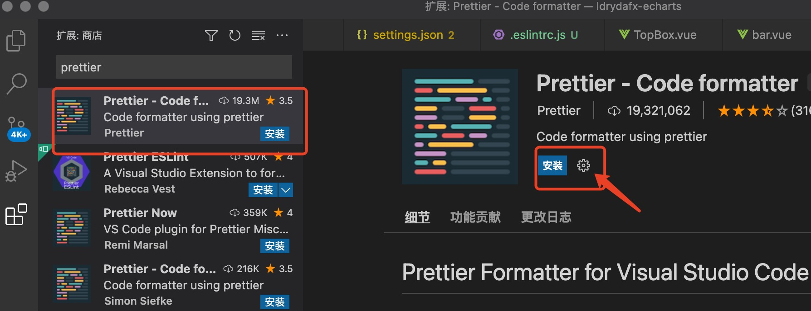
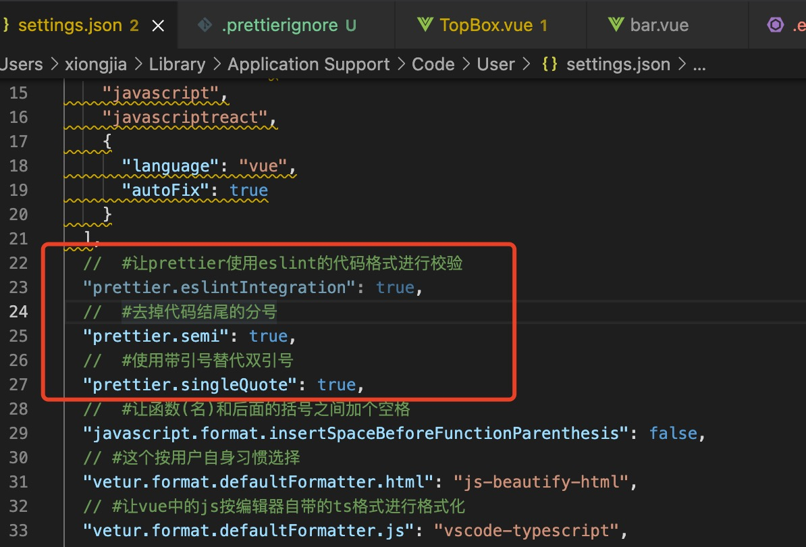
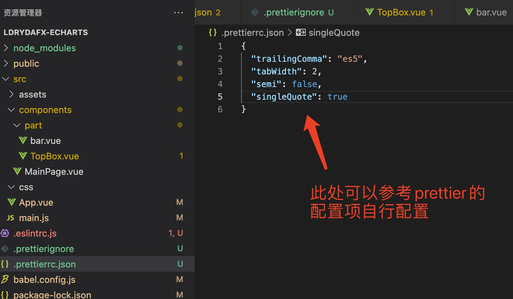
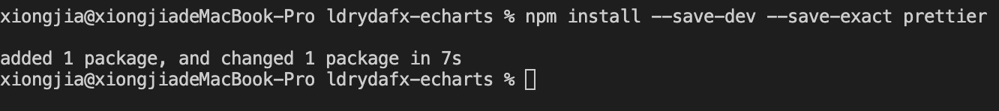
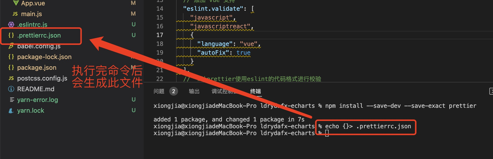
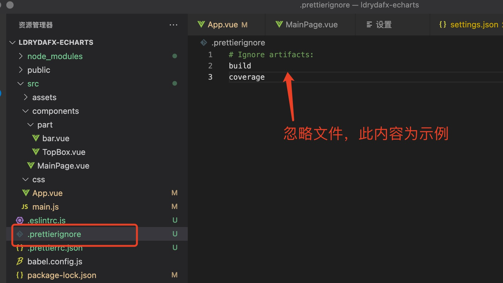
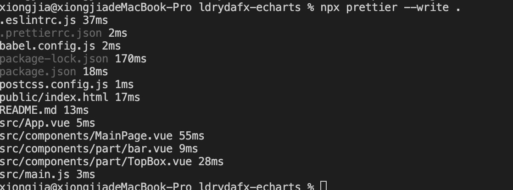
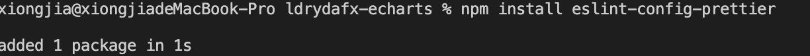

# prettier
55
prettier 官网地址: <https://www.prettier.cn/docs/index.html>

## vscode 插件安装
rb
- 进入插件市场安装插件
  
- 配置

  - 插件安装成功后，编辑器的配置 settings.json 文件会出现 prettier 插件的相关配置节点，同时也能看到一些默认的配置信息，可以在 settings.json 添加相关配置。
    

  - 在项目中较推荐用配置文件.prettierrc 的方式进行针对性的配置，方便团队协作使用。比如在项目根目录添加配置文件 .prettierrc.js 或者 .prettierrc.json 文件等。
    

  更多配置文件的选项可参考官网: <https://prettier.io/docs/en/configuration.html>

## npm / yarn 安装

### 1. 首先在本地安装 prettier

```
npm install --save-dev --save-exact prettier
或
yarn add --dev --exact prettier
```



### 2. 配置文件

创建一个空配置文件，让编辑器和其他工具知道您正在使用 Prettier

```
echo {}> .prettierrc.json
```



### 3. 忽略文件

创建一个.prettierignore 文件，让 Prettier CLI 和编辑器知道哪些文件不应格式化

```
echo > .prettierignore
```



- 一些常用的忽略文件配置

```
# Ignore artifacts:
/node_modules
/dist
/src/lib/

/.vscode
.eslintrc.js
package.json
package-lock.json
/build/
/config/
/dist/
/*.js
```

::: tip 提示

1. 将.prettierignore 建立在.gitignore 和.eslintignore 的基础上（如果您有的话）。
2. 如果您的项目尚未准备好格式化，例如 HTML 文件，请在.prettierignore 文件中添加\*.html。

:::

### 4. 使用

- 格式化所有文件

```
npx prettier --write .
或
yarn prettier --write .
```

- 对于大项目来说，格式化所有文件可能需要一定的时间，所以用户可以使用以下命令格式化部分文件：

```
<!-- prettier前面要加yarn或者npx,write后面跟的是项目或项目中的文件目录 -->
prettier --write app/
或
prettier --write app/components/Button.js
或
prettier --write "app/**/*.test.js"
```



- 如果你有一个 CI 设置，运行以下程序作为其中的一部分，以确保每个人都运行了 prettier，这避免了合并冲突和其他协作问题.

```
npx prettier --check .
```

::: tip
--check 和 --write 很像，但是 check 只是检查文件是否已格式化，并不会覆盖它们。
:::

## prettier 配置项

官网: <https://prettier.io/docs/en/options.html>

## eslint & prettier

如果您使用 ESLint，请安装 eslint-config-prettier，它关闭了所有不必要的或可能与 Prettier 冲突的 ESLint 规则。

```
npm install eslint-config-prettier
或
yarn add --dev eslint-config-prettier
```



- 在.slintrc 文件配置如下代码

```
{
  "extends": ["prettier"]
}
```
