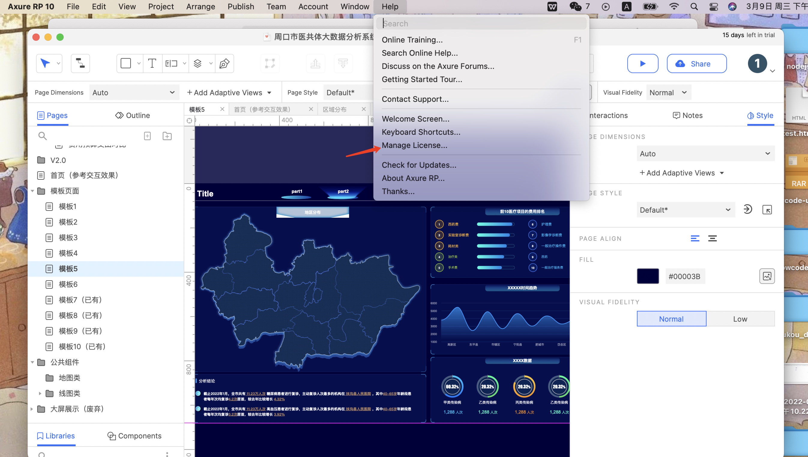

# axure

## 下载

目前查看原型图的 axure 版本需要在 axure rp9 以上，所以建议用户下载以下两个版本：  
axure rp9 下载地址: <https://www.axure.com.cn/78629>  
axure rp10 下载地址: <https://www.axure.com>

## 安装

- windows 系统  
  安装步骤参考: <https://blog.csdn.net/a18870525682/article/details/115768018>
- macOS 系统
  安装步骤参考: <https://blog.51cto.com/u_15294985/3007688>  
  安装完成后需要用户自己去购买或者寻找激活码。可点击下图所示菜单项，输入激活码；也可以在打开应用时输入激活码。具体步骤可参考:<https://www.zhihu.com/zvideo/1300834347306975232>  
  

## 使用

基本功能介绍: <https://www.axure.com.cn/78577>
