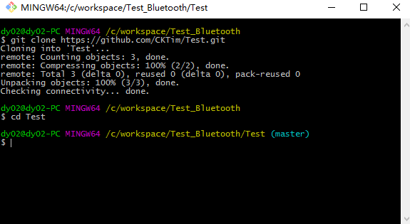

# git

## Git 的安装
### 1.Git 的下载
下载地址：[git-scm.com](http://git-scm.com/downloads)


### 2.Git 的安装
当前文档案例下载的版本是 Git-2.13.0-64-bit.exe，接下来我们就对这个版本进行安装工作。

#### 2.1 使用许可声明
双击下载后的 Git-2.13.0-64-bit.exe，开始安装，这个界面主要展示了 GPL 第 2 版协议的内容，点击 <kbd>next</kbd> 到第二步。


#### 2.2 选择安装目录


#### 2.3 选择安装组件


#### 2.4 选择开始菜单文件夹
可直接默认选择，点击next


#### 2.5 修改系统环境变量


#### 2.6 SSL证书的选择


#### 2.7 配置行尾结束符
一般情况选择第三个，可根据自己情况而定


#### 2.8 配置终端仿真


#### 2.9 其他的配置
默认选择即可


#### 2.10 安装完成


启动 Git Bash 应用，在终端输入下面指令查看当前 git 安装版本
```
git --version
```


## Git上传代码到仓库
首先我们需要一个github账号，还没有的话去 [github](https://github.com/) 注册（若无法进入github官网，请先下载左侧 tools 菜单中的DevSidecar工具）

### 1.注册完成后，进入Github首页，点击New repository新建一个项目


### 2.填写相应信息后点击create即可
__Repository name__: 仓库名称

__Description__(可选): 仓库描述介绍

__Public, Private__ : 仓库权限（公开共享，私有或指定合作者）

__Initialize this repository with a README__ :添加一个README.md

__gitignore__: 不需要进行版本管理的仓库类型，对应生成文件.gitignore

__license__: 证书类型，对应生成文件LICENSE  


仓库创建完成


### 3.点击Clone or dowload会出现一个地址，copy这个地址备用


### 4.开始上传项目
接下来就到本地操作，右键你的项目，如果之前安装git成功的话，右键会出现两个新选项，分别为Git Gui Here,Git Bash Here,这里我们选择Git Bash Here，进入如下界面，Test_Bluetooth即为当前项目名。


### 5.把github上面的仓库克隆到本地
```
git clone https://github.com/CKTim/BlueTooth.git
(git clone 后面的地址替换为第三步copy的地址)
```


### 6.复制本地项目代码到克隆仓库
上个步骤以后你的本地项目文件夹下面就会多出个文件夹，该文件夹名即为你github上面的项目名，如图我多出了个Test文件夹，我们把本地项目文件夹下的所有文件（除了新多出的那个文件夹不用），其余都复制到那个新多出的文件夹下


### 7.开始提交代码
输入命令 cd Test，进入Test文件夹


接下来依次输入以下代码即可完成其他剩余操作
```
git add . （注：别忘记后面的.，此操作是把Test文件夹下面的文件都添加进来）

git commit  -m  "提交信息"  （注：“提交信息”里面换成你需要，如“first commit”）

git push -u origin master   （注：此操作目的是把本地仓库push到github上面，此步骤需要你输入帐号和密码；此外注意分支名称，若分支名称不同替换master即可）
```


提交完成！

### 提交过程中可能出现的问题
#### a.出现提交错误

解决：这是通过Git GUI进行提交时发生的错误，由 .git 文件夹中的文件被设为“只读”所致，将 .git 文件夹下的所有文件、文件夹及其子文件的只读属性去掉即可。

#### b.如果出现无法同步或没有权限，解决方法如下：
用户名和密码一定要和github上的一致。


## Git代码更新
### 1.更新代码到本地
```
git pull
```
### 2.修改本地代码后更新代码
```
git add .
```
### 3.查看当前仓库状态
```
git status
```
### 4.输入更新代码说明
```
git commit -m "更新说明"
```
### 5.提交到远程分支上
```
git push origin master
```

## Git提交回滚
```
* git revert HEAD             //撤销前一次 commit
* git revert HEAD^            //撤销前前一次 commit
* git revert commit （比如：fa042ce57ebbe5bb9c8db709f719cec2c58ee7ff）撤销指定的版本，撤销也会作为一次提交进行保存。
```

## vscode中git提交代码
详细步骤: <https://blog.csdn.net/weixin_44994731/article/details/109305995>
