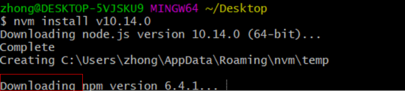
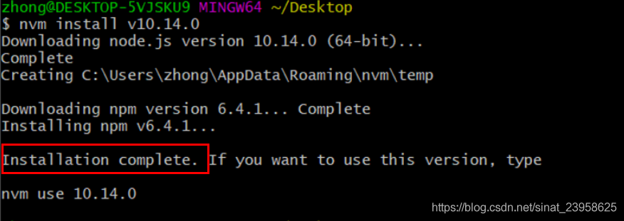

## 安装node.js
已经配置好的nvm环境变量，现在开始利用nvm安装nodejs，以及使用/切换指定版本的nodejs。

### 1.nvm安装命令
首先在cmd命令行中执行nvm install lastest，此时即可下载最新版本的nodejs。
```
nvm install lastest
//如果要下载特定版本，后面跟上版本号，如：nvm install 11.6.0
```
### 2.安装过程关键点
Downloading 代表正在下载npm，一定要等下载完，不然会发现npm将无法使用。
 
 Installation complete 代表nodejs安装完成
 

 ## 切换node.js版本
 ### 1.查看当前安装的所有nodejs版本
 ```
 nvm list 
 ```
 ### 2.切换nodojs命令
 ```
 nvm use 11.6.0(需要的版本)
 ```