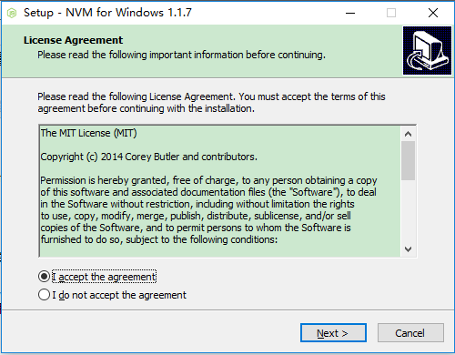
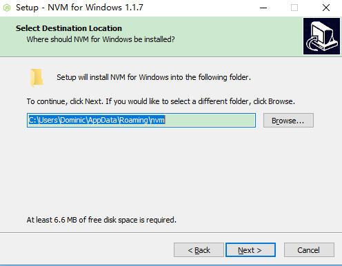
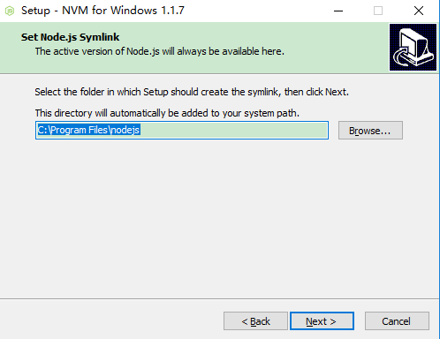
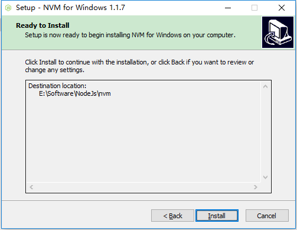
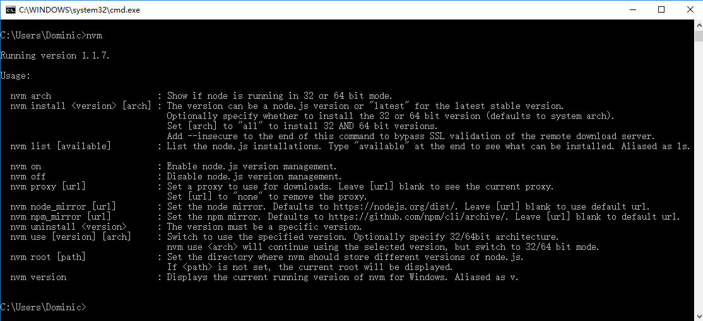
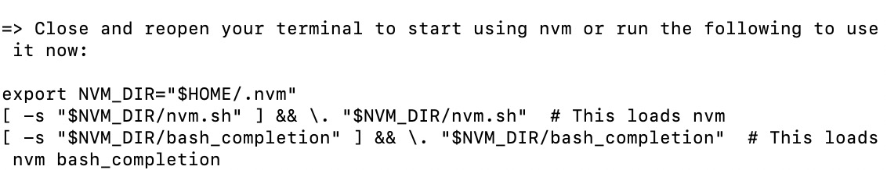
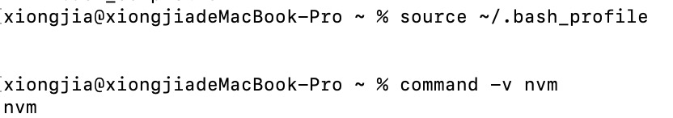

# nvm

## 下载 nvm

nvm 下载链接: <https://github.com/coreybutler/nvm-windows/releases>

- nvm-noinstall.zip：绿色免安装版，但使用时需进行配置
- nvm-setup.zip：安装版

## 安装 nvm

### 1. windows 系统安装版

- 双击安装文件 nvm-setup.exe  
  
- 选择 nvm 安装路径  
  
- 选择 nodeJS 安装路径  
  
- 开始安装  
  
- 安装完确认
  打开 CMD，输入命令 <kbd>nvm</kbd> ，安装成功则如下显示:  
   

### 2. windows 系统免安装版

- 将下载好的压缩包解压到一个全英文路径（eg：c/users/)
- 如果解压后的文件中有 settings.txt 文件，那么直接打开（如果没有，新建一个）。向里面添加几个配置项：

  > root: 当前 nvm.exe 所在的目录；  
  > path: node 快捷方式所在的目录；  
  > arch: 当前操作系统的位数（32/64）；  
  > proxy: 表示代理，一般不用配置，有的直接设置为 none；

- 配置环境变量
  - 首先打开电脑的系统属性面板（快捷方式为：window+r => sysdm.cpl）
  - 点击高级选项卡，选择环境变量
  - 新建用户变量：
    > NVM_HOME 值: 当前 nvm.exe 所在目录  
    > NVM_SYMLINK 值: node 快捷方式所在目录  
    > PATH 值: %NVM_HOME%;%NVM_SYMLINK%
  - 检测环境变量是否配置成功：
    打开 cmd 窗口输入 <kbd>set</kbd> 命令，此时打印了所有电脑中配置的环境变量；也可以在 <kbd>set</kbd> 加变量名查看这三个命令。

### 3. mac 系统

- 安装命令

  ```
  sudo curl -o- https://raw.githubusercontent.com/nvm-sh/nvm/v0.39.0/install.sh | bash
  ```

  其中 0.39.0 可以替换为当前最新的版本号。安装完成如下：

  

- 将上图从 export 到最后的几行内容复制到.bash_profile 文件中，具体操作为：输入 <kbd>vim ~/.bash_profile</kbd> 打开这个文件，将上面内容粘贴进去，然后点击 esc，输入 <kbd>:wq </kbd>保存并退出；打开访达，在 mac 用户的根目录下使用 shift+command+.显示隐藏文件，会看到.bash_profile 文件，打开，粘贴内容后保存。
- 执行

```
source ~/.bash_profile
```

- 测试是否安装成功

```
command -v nvm
```

  
::: tip  
上述配置环境变量针对的是使用 bash 作为 shell 的电脑。如果使用的是 zsh，则需要在当前用户根目录下创建.zshrc 的文件，然后对应的把上述代码添加上去。
:::

## nvm 常用命令

```
nvm install <version> [arch]     // 安装制定版本的node 并且可以指定平台 version 版本号  arch 平台
nvm list [available]
  - nvm list                    // 查看已经安装的版本
  - nvm list installed          // 查看已经安装的版本
  - nvm list available          // 查看网络可以安装的版本
nvm on                          // 打开nodejs版本控制
nvm off                         // 关闭nodejs版本控制
nvm uninstall <version>         // 卸载制定的版本
nvm use [version] [arch]        // 切换制定的node版本和位数
nvm version                     // 查看当前的版本
```

了解更多命令参考: <https://www.cnblogs.com/zbx-boke/p/9383002.html>
