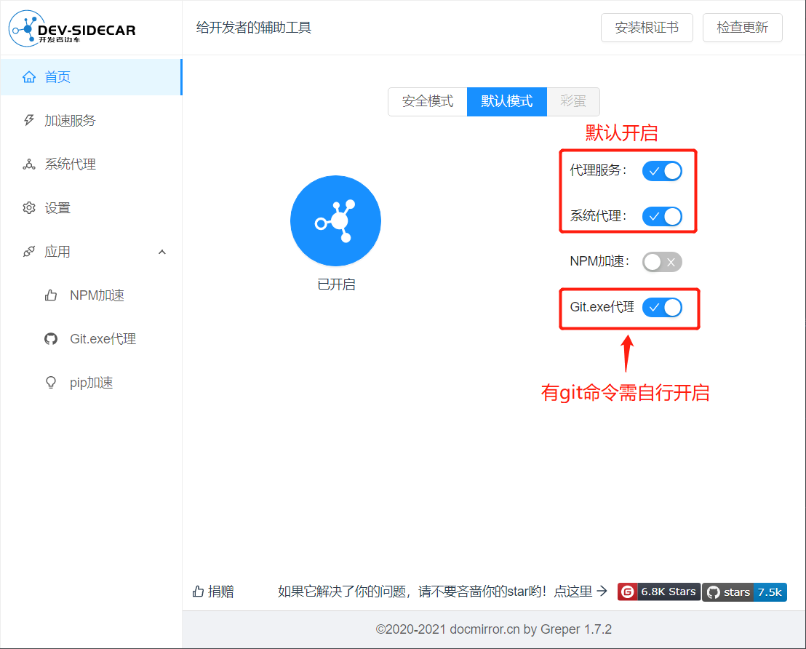
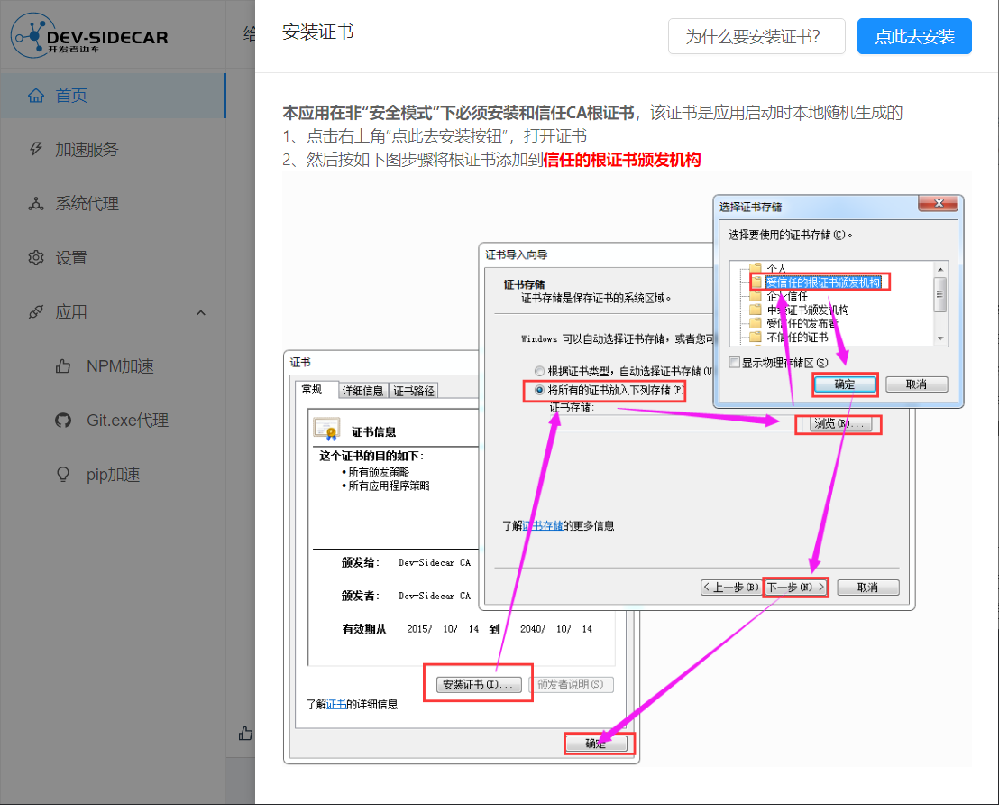
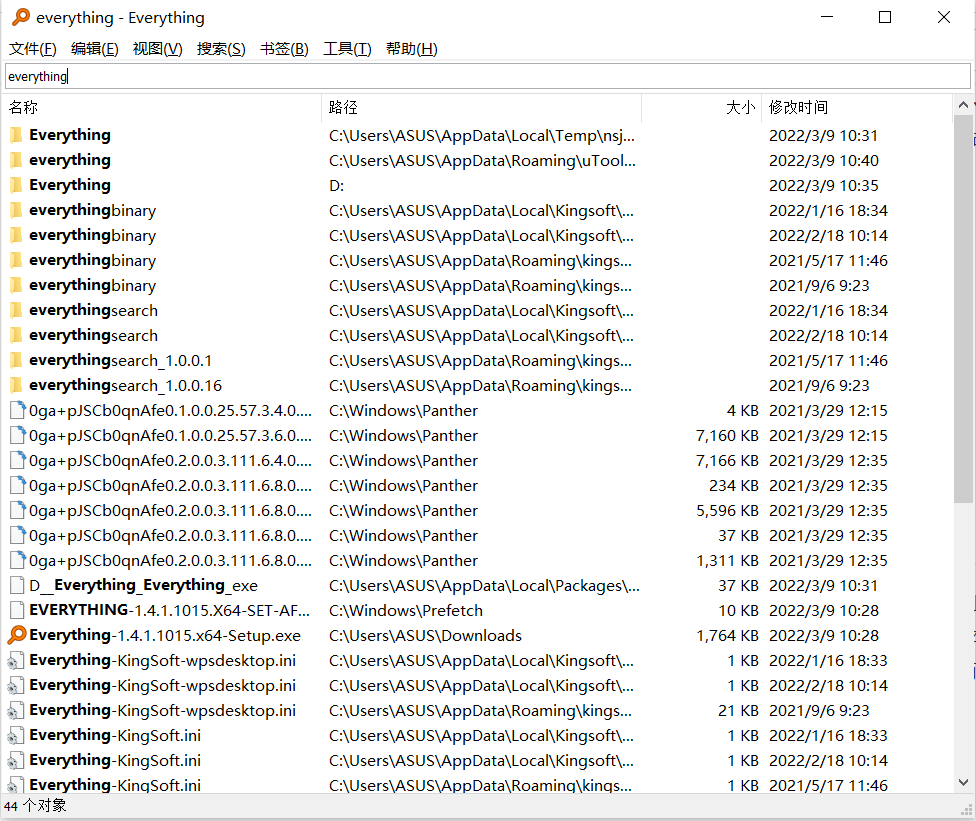
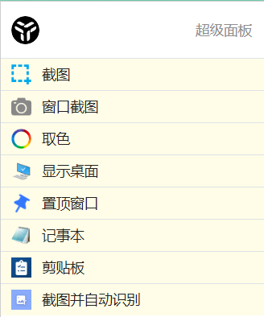

# 其他开发工具

## DevSidecar

### 下载

github 下载地址: <https://github.com/docmirror/dev-sidecar/releases>  
gitee 下载地址: <https://gitee.com/docmirror/dev-sidecar/releases>

Windows: 请选择 DevSidecar-x.x.x.exe  
Mac: 请选择 DevSidecar-x.x.x.dmg  
Ubuntu: 请选择 DevSidecar-x.x.x.deb  
其他 linux: 请选择 DevSidecar-x.x.x.AppImage (未做测试，不保证能用)

### 安装

注意: mac 版安装需要在“系统偏好设置->安全性与隐私->通用”中解锁并允许应用安装

更多详细介绍前往: <https://github.com/docmirror/dev-sidecar>

### 注意事项

1. DevSidecar 应用开启后会修改系统代理，直接重启电脑可能会无法上网。重启电脑后，再次启动应用即可恢复。如果需要卸载 DevSidecar，在卸载前需完全退出 DevSidecar 应用后再进行卸载。
2. 首次安装好该软件后，需要安装根证书，点击软件首页右上角的安装根证书选项，然后跟着步骤操作即可。
   

## Everything

### 下载

官网下载地址：<https://www.voidtools.com/zh-cn/>
::: tip  
Everything 目前不支持 macOS 系统。
:::

### 使用

在搜索栏输入想要搜索到的文件名即可，并可在上方搜索栏中调整想要的检索规则。

更多 Everything 使用教程：<https://xbeta.info/everything-search-tool.htm>

## utools

### 下载

官网下载地址：<http://www.u.tools>

### 使用

在插件市场，可以搜索下载常用工具插件。

此外 uTools 还包含很多本地工具插件，可在安装软件时根据根据个人需求选择(默认点击鼠标中间呼出)。  

更多 utools 使用教程：<http://www.u.tools/docs/guide/skills.html>

## postman

### 下载

官网下载地址：<https://www.postman.com/downloads/>

### 使用

postman 使用教程：<https://learning.postman.com/docs/getting-started/introduction/>
