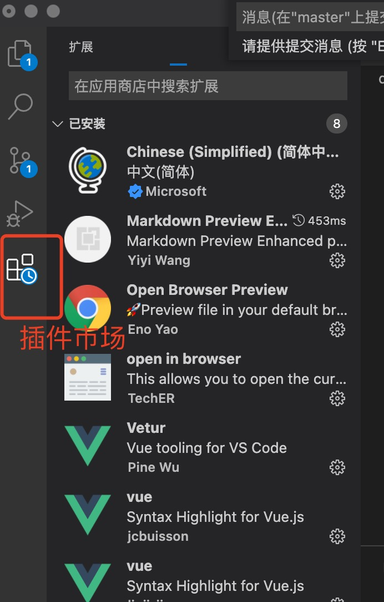

# vscode

## 下载

vscode 下载地址: <https://code.visualstudio.com>

## 安装

- windows 系统  
  安装步骤参考: <https://www.cnblogs.com/csji/p/13558221.html>
- macOS 系统  
  安装步骤参考: <https://blog.csdn.net/u014028317/article/details/106089299/>

## 插件安装

1. 进入 vscode 插件市场
   
2. 安装下列插件（前四个为必须安装）

| 插件名称                                                  | 用途               |
| :-------------------------------------------------------- | :----------------- |
| EditorConfig for VS Code                                  | 统一编码风格       |
| ESLint                                                    | 代码校验           |
| Prettier - Code formatter                                 | 代码格式化         |
| Vetur                                                     | 格式化 vue 文件    |
| Auto Close Tag                                            | 自动关闭标签       |
| Auto Rename Tag                                           | 自动重命名标签     |
| Better Comments                                           | 美化注释样式       |
| Chinese（Simplified）Language Pack for Visual Studio Code | 汉化包             |
| GitLens - Git supercharged                                | 版本管理           |
| npm Intellisense                                          | npm 包路径自动补全 |
| Path Intellisense                                         | 文件路径自动补全   |
| TODO Tree                                                 | TODO 汇总          |
| vscode-icons                                              | 美化文件图标       |
