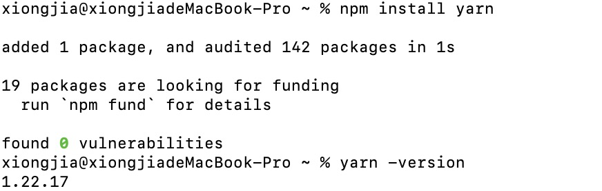

# yarn

## yarn 的安装

在此之前我们已经安装了 nodejs，所以我们使用 npm 安装

```
npm install -g yarn
```

查看 yarn 的版本

```
yarn --version
```

安装示例图：


## yarn 常用命令

```
yarn -v             //查看版本
yarn init           // 创建新工程，通过交互式会话创建一个package.json
yarn                    //安装依赖
yarn install --force    //强行下载安装
yarn cache clean                    // 清除缓存
```

了解更多命令参考: <https://cloud.tencent.com/developer/section/1477721>
